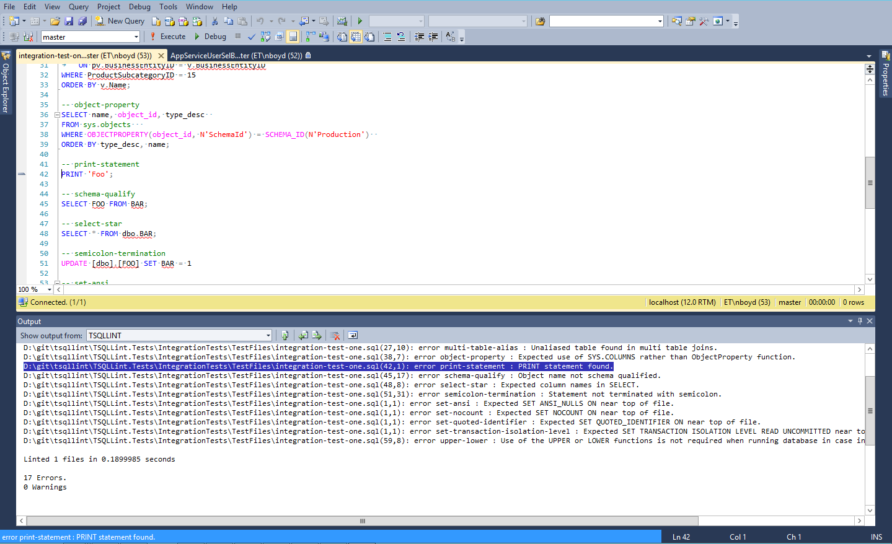

[](https://circleci.com/gh/tsqllint/tsqllint/tree/main)
[](https://coveralls.io/github/tsqllint/tsqllint?branch=main)
[](https://badge.fury.io/js/tsqllint)
[](https://www.npmjs.com/package/tsqllint)
[](https://gitter.im/TSQLLint/Lobby)

# TSQLLint

TSQLLint is a tool for describing, identifying, and reporting the presence of anti-patterns in TSQL scripts.

## Installation

TSQLLint currently officially supports installation with dotnet-tool, Homebrew, and NPM.

### Install with dotnet tool

```
$ dotnet tool install --global TSQLLint
```

### Install with Homebrew

For OSX and Linux the recommended method of installing TSQLLint is to install the tool using homebrew.

```shell
$ brew tap tsqllint/homebrew-tsqllint
$ brew install tsqllint
```

### Install with NPM

TSQLLint may also be installed with NPM

This binary can be installed though [the `npm` registry](https://www.npmjs.com/). First, install [Node.js version 4 or higher](https://nodejs.org/en/download/), and then install using the [`npm install` command](https://docs.npmjs.com/getting-started/installing-npm-packages-locally):

```bash
npm install tsqllint -g
```

## Usage

```bash
# lint a single file
tsqllint test.sql

# fix all auto-fixable problems (--fix or -x)
tsqllint --fix test.sql

# lint all files in a directory
tsqllint c:\database_scripts

# lint a list of files and directories, paths with whitespace must be enclosed in quotes
tsqllint file_one.sql file_two.sql "c:\database scripts"

# lint using wild cards
tsqllint c:\database_scripts\sp_*.sql

# print path to .tsqllintrc config file
tsqllint --print-config

# display usage info
tsqllint --help

# list the plugins loaded
tsqllint --list-plugins
```

## Integrating TSQLLint with other Tools

### Visual Studio Code Extension

In addition to the CLI tool, TSQLLint is built into a [Visual Studio Code Extension](https://marketplace.visualstudio.com/items?itemName=tsqllint.tsqllint). This extension can be installed from within the VS Code Extension Interface or from the VS Code Extension marketplace.


### SQL Server Management Studio

TSQLLint uses a common message format that allows for integration into off the shelf tools. SQL Server Management Studio can use TSQLLint using SSMS's External Tools feature.



## Configuration

TSQLLint utilizes a configuration file called `.tsqllintrc`. This file can be generated and edited by users to create their own configurations. To generate this file use the `-i` or `--init` flags. If no `.tsqllintrc` is found the tool will use a default configuration loaded in memory.

```bash
# generate a default .tsqllintrc file using the init flag (optional if just using a default configuration)
tsqllint --init
```

## Creating custom configurations

To configure TSQLLint edit its config file, which is named `.tsqllintrc`. To find its location run `tsqllint` with the `--print-confg` or `-p` option.

TSQLLint will load its config file in the following order or precedence:

1. The value passed with the `-c` command line argument, if one is passed
2. An Environment Variable named `TSQLLINTRC`
3. A file named `.tsqllintrc` in the same local directory in which TSQLLint is executing
4. A file named `.tsqllintrc` in the user's home directory

## Rule configuration

TSQLLint rules may be set to "off", "warning", or "error". Rules that are violated and are set to "error" will result in TSQLLint returning a non-zero exit code. Rules that are violated, but configured to "warning" will result in a zero exit code, but a warning message will be displayed in the shell output. Rules that are set to "off" will be completely ignored. Rules that are not present in the `.tsqllintrc` configuration are set to "off"

```json
{
  "rules": {
    "case-sensitive-variables": "error",
    "conditional-begin-end": "error",
    "count-star": "error",
    "cross-database-transaction": "error",
    "data-compression": "error",
    "data-type-length": "error",
    "delete-where": "error",
    "disallow-cursors": "error",
    "full-text": "error",
    "information-schema": "error",
    "keyword-capitalization": "error",
    "linked-server": "error",
    "multi-table-alias": "error",
    "named-constraint": "error",
    "non-sargable": "error",
    "object-property": "error",
    "print-statement": "error",
    "schema-qualify": "error",
    "select-star": "error",
    "semicolon-termination": "error",
    "set-ansi": "error",
    "set-nocount": "error",
    "set-quoted-identifier": "error",
    "set-transaction-isolation-level": "error",
    "set-variable": "error",
    "update-where": "error",
    "upper-lower": "error",
    "unicode-string": "error"
  }
}
```

## Disabling Rules with Inline Comments

To temporarily disable all rule warnings in a script, use comments in the following format:

```tsql
/* tsqllint-disable */

SELECT * FROM FOO;

/* tsqllint-enable */
```

To disable or enable warnings for specific rules:

```tsql
/* tsqllint-disable select-star */

SELECT * FROM FOO;

/* tsqllint-enable select-star */
```

To disable warnings for the entire script, place a /_ tsqllint-disable _/ comment at the top of the file:

```tsql
/* tsqllint-disable */

SELECT * FROM FOO;
```

To disable specific rule warnings for the entire script place a comment similar to the following at the top of the file:

```tsql
/* tsqllint-disable select-star */

SELECT * FROM FOO;
```

## SQL Compatibility Level

TSQLLint provides a configurable "compatibility-level" that aligns with [SQL Server's Compatibility Level](http://docs.microsoft.com/en-us/sql/relational-databases/databases/view-or-change-the-compatibility-level-of-a-database). The value defaults to 120 but may be changed with the following edit to the `.tsqllintrc` or by using inline comments within the SQL file. TSQLLint supports the following compatibility levels 80, 90, 100, 110, 120, 130, 140, and 150.

### Setting a default Compatibility Level using .tsqllintrc

Setting the compatibility level within the `.tsqllintrc` file configures the default Compatibility Level for all files.

```json
{
  "rules": {
    "upper-lower": "error"
  },
  "compatability-level": 90
}
```

### Setting Compatibility Level Using Inline Comments

Setting the compatibility level using inline comments configures the Compatibility Level for just that file. Overrides should be placed at the top of files.

```tsql
/* tsqllint-override compatability-level = 130 */

SELECT * FROM FOO;
```

## SQL Placeholders

Many tools in the SQL ecosystem support placeholders to templatize SQL files as shown in the example below:

```tsql
SELECT * FROM FOO WHERE BAR = '$(MyPlaceholderValue)';
```

Before applying any linting rules, TSQLLint will replace any placeholder in a SQL file with values provided via environment variables.

## Plugins

You can extend the base functionality of TSQLLint by creating a custom plugin. TSQLLint plugins are Dotnet assemblies that implement the IPlugin interface from [TSQLLint.Common](https://www.nuget.org/packages/TSQLLint.Common/). Ensure the plugin is targeting `netcoreapp2.0`.

After developing the plugin, update the .tsqllintrc file to point to its `.dll`.

```json
{
  "rules": {
    "upper-lower": "error"
  },
  "plugins": {
    "my-first-plugin": "c:/users/someone/my-plugins/my-first-plugin.dll",
    "my-second-plugin": "c:/users/someone/my-plugins/my-second-plugin.dll/"
  }
}
```

This sample plugin notifies users that spaces should be used rather than tabs.

```csharp
using System;
using TSQLLint.Common;
using System.IO;

namespace TSQLLint.Tests.UnitTests.PluginHandler
{
    public class SamplePlugin : IPlugin
    {
        public void PerformAction(IPluginContext context, IReporter reporter)
        {
            string line;
            var lineNumber = 0;

			var reader = new IO.StreamReader(File.OpenRead(context.FilePath));

            while ((line = reader.ReadLine()) != null)
            {
                lineNumber++;
                var column = line.IndexOf("\t", StringComparison.Ordinal);
                reporter.ReportViolation(new SampleRuleViolation(
                    context.FilePath,
                    "prefer-tabs",
                    "Should use spaces rather than tabs",
                    lineNumber,
                    column,
                    RuleViolationSeverity.Warning));
            }
        }
    }

    class SampleRuleViolation : IRuleViolation
    {
        public int Column { get; private set; }
        public string FileName { get; private set; }
        public int Line { get; private set; }
        public string RuleName { get; private set; }
        public RuleViolationSeverity Severity { get; private set; }
        public string Text { get; private set; }

        public SampleRuleViolation(string fileName, string ruleName, string text, int lineNumber, int column, RuleViolationSeverity ruleViolationSeverity)
        {
            FileName = fileName;
            RuleName = ruleName;
            Text = text;
            Line = lineNumber;
            Column = column;
            Severity = ruleViolationSeverity;
        }
    }
}
```
